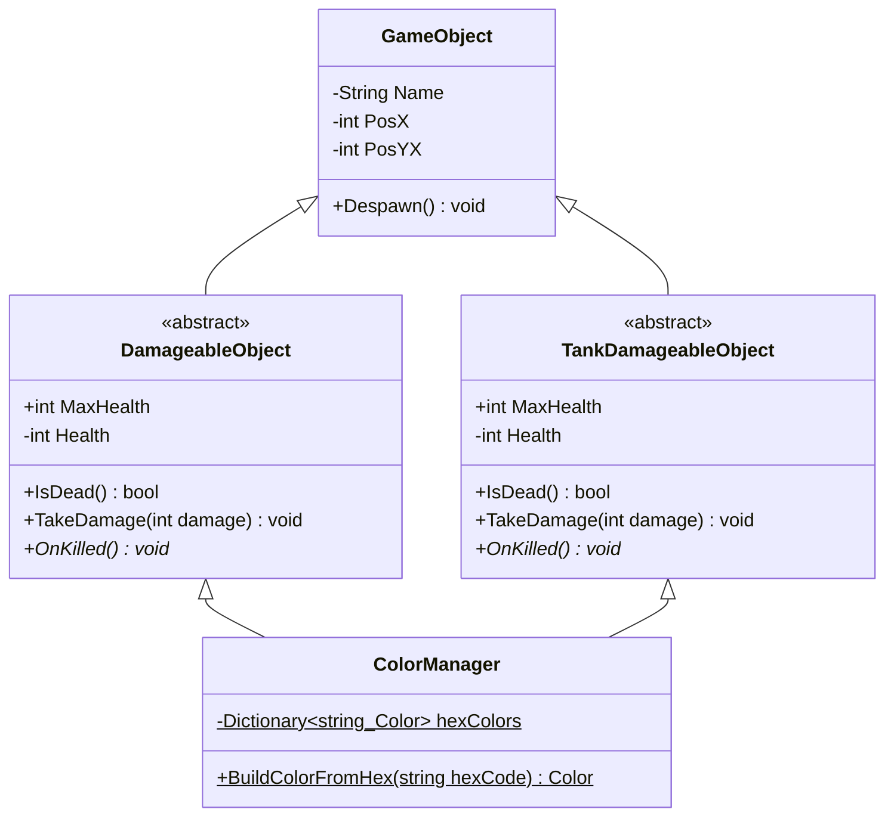

# Mermaid test

```mermaid
classDiagram
    class GameObject {
        -String Name
        -int PosX
        -int PosYX
        +Despawn() void
    }
    class DamageableObject {
        <<abstract>>
        +int MaxHealth
        -int Health
        +IsDead() bool
        +TakeDamage(int damage) void
        +OnKilled()* void
    }

    class TankDamageableObject {
        <<abstract>>
        +int MaxHealth
        -int Health
        +IsDead() bool
        +TakeDamage(int damage) void
        +OnKilled()* void
    }

    
    GameObject <|-- DamageableObject
    GameObject <|-- TankDamageableObject
    
    
    
    class ColorManager {
        -Dictionary~string_Color~ hexColors$
        +BuildColorFromHex(string hexCode)$ Color
    }

    DamageableObject <|-- ColorManager
    TankDamageableObject <|-- ColorManager
    
    
```
